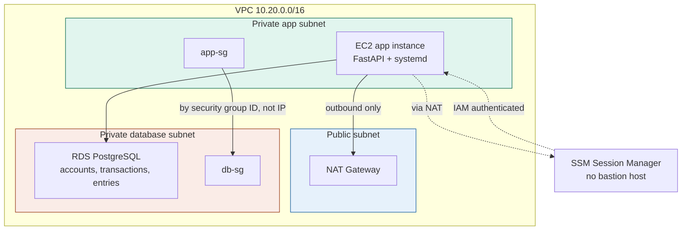

# aws-rds-fintech-ledger

A compliance-minded double-entry ledger service (FastAPI + PostgreSQL on
AWS RDS), built to demonstrate production-grade RDS security patterns,
backup/restore discipline, and infrastructure-as-code practices for a
fintech-style backend.

This is a portfolio project, not a production system — see
[Cost & lifecycle](#cost--lifecycle) below for what that means in
practice.

## What this demonstrates

- A three-tier VPC with RDS PostgreSQL fully isolated in a private
  subnet — no public access, ever.
- Security group chaining (app → db by security group ID, not CIDR
  block) so database access survives IP churn without any rule changes.
- SSM Session Manager for shell access to the app server — no bastion
  host, no open SSH port, no long-lived SSH keys.
- Secrets (DB credentials) delivered via SSM Parameter Store
  (SecureString), never baked into an AMI, a Docker image, or committed
  to this repository.
- A real double-entry bookkeeping data model with a zero-sum invariant
  enforced at the API boundary, not just a CRUD wrapper around a table.
- Alembic-managed schema migrations, applied by the same bootstrap
  process that deploys the application.
- A backup/restore drill actually exercised end to end — snapshot,
  simulated data loss, restore into a fresh instance, verification —
  not just "backups are enabled."
- Six real, unstaged infrastructure incidents hit and resolved during
  development, each documented with root cause and fix.

## Architecture



The database tier has no route to the internet at all — not blocked by
a security group rule, but physically absent from its route table.

Two things worth calling out that aren't obvious from the diagram alone:

**Security group chaining.** The database security group's only ingress
rule references the app security group's ID directly
(`security_groups = [aws_security_group.app.id]`), not a CIDR block. If
the app instance is replaced and gets a new private IP, database access
keeps working with zero changes to any security group rule.

**SSM instead of a bastion.** The app EC2 instance has no public IP and
no inbound rule for SSH at all. Shell access goes through SSM Session
Manager, authenticated via IAM, with every session logged to
CloudTrail. There's no bastion host to patch, no SSH key to rotate or
leak.

## Data model

The core of the application is a standard double-entry ledger:

- **`accounts`** — named accounts with a type (asset, liability,
  equity, revenue, expense) and currency.
- **`transactions`** — a thin grouping container; it has no amount of
  its own.
- **`entries`** — the actual debit/credit lines. Each entry has a
  single signed `amount` (positive = debit, negative = credit), and
  every transaction's entries must sum to exactly zero. That
  zero-sum invariant is enforced by a Pydantic validator at the API
  boundary, before anything reaches the database — see
  `app/schemas/transaction.py`.

## Repository layout

```
terraform-bootstrap/   One-time setup: S3 + state locking for Terraform state
terraform/             Main infrastructure: VPC, RDS, EC2, IAM, SSM parameters
app/                    FastAPI application, SQLAlchemy models, Alembic migrations
docs/
  architecture/         Architecture notes and diagrams
  adrs/                  Architecture Decision Records — context, alternatives, tradeoffs
  incidents/             Real incidents hit during development, with root cause and fix
  runbooks/              Operational procedures, e.g. the backup/restore drill
```

## Incidents hit during development

Six real infrastructure failures were hit and resolved while building
this project — not staged for the portfolio, but kept and documented
because each one taught something concrete about the gap between a
clean `terraform plan` and a working system:

| # | What broke | Root cause |
|---|---|---|
| [001](docs/incidents/incident-001-sg-description-ascii.md) | Security group creation failed | AWS requires ASCII-only text in `GroupDescription`; an em dash broke it |
| [002](docs/incidents/incident-002-rds-backup-retention-free-tier.md) | RDS creation failed | Free-tier accounts cap backup retention below the value this project first used |
| [003](docs/incidents/incident-003-ec2-root-volume-ami-snapshot-size.md) | EC2 creation failed | Root volume was smaller than the current AMI's backing snapshot |
| [004](docs/incidents/incident-004-env-file-password-shell-metacharacters.md) | DB connection failed | Generated password's special characters broke unquoted shell parsing of `.env` |
| [005](docs/incidents/incident-005-systemd-environmentfile-vs-shell-source.md) | (caught before deploy) | systemd's `EnvironmentFile` parser doesn't follow the same quoting rules as shell `source` |
| [006](docs/incidents/incident-006-alembic-enum-double-create.md) | Migration failed | A PostgreSQL ENUM type was created twice in one migration — once explicitly, once via SQLAlchemy's automatic DDL event |

The common thread: a clean `terraform plan` does not guarantee a
successful `apply`. Several of these only surface against the live AWS
API, a specific AMI, or a specific account's tier restrictions — none
of it visible from reading the Terraform code alone.

## Backup / restore drill

A full backup/restore cycle was actually run against this
infrastructure — not simulated in writing. See
[`docs/runbooks/backup-restore-drill.md`](docs/runbooks/backup-restore-drill.md)
for the exact commands, the real snapshot/instance identifiers, and the
before/after data used to confirm the restore was genuine.

## Architecture decisions

Non-obvious infrastructure choices are recorded as ADRs in
[`docs/adrs/`](docs/adrs/), each with the context, the alternatives
considered, and the tradeoff accepted — for example, why RDS over a
self-managed PostgreSQL instance, why EC2 over ECS Fargate for this
particular project, and why the ledger uses a single signed `amount`
column instead of separate debit/credit columns.

## Cost & lifecycle

This infrastructure is not meant to run indefinitely. RDS (especially
if switched to Multi-AZ for a resilience demo) and the NAT Gateway both
bill continuously while they exist, regardless of whether anyone is
actively using them. The practice on this project:

- `enable_multi_az` defaults to `false` for cheap iteration during
  development; it gets flipped to `true` only briefly, to validate the
  resilience pattern and take final screenshots, then the whole stack
  is destroyed.
- `terraform destroy` is run once the project reaches a stable
  checkpoint, leaving only the S3 state bucket and DynamoDB-adjacent
  lock file behind (both effectively free at this scale).
- The one manual RDS snapshot created for the backup/restore drill is
  intentionally left in place afterward as evidence the recovery path
  actually works — everything else from that drill (the temporary
  restored instance) was torn down immediately after verification.

## Running this yourself

1. `terraform-bootstrap/` — apply once to create the S3 state bucket.
2. `terraform/` — `terraform init && terraform plan && terraform apply`
   to stand up the VPC, RDS, EC2, and supporting IAM/SSM resources.
3. The EC2 instance's bootstrap script clones this repository, installs
   dependencies, runs Alembic migrations, and starts the API under
   systemd automatically — no manual deployment step needed on a clean
   `apply`.
4. Connect via SSM Session Manager (`aws ssm start-session
   --target <instance-id>`) to inspect the running service or query the
   database directly.

No SSH key, no bastion host, and no public IP are needed anywhere in
this flow.
